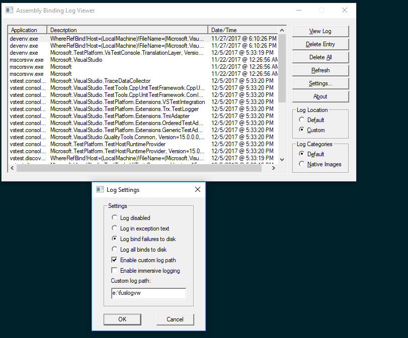

# Troubleshoot vstest
This document helps to figure out root cause of unexpected behavior of vstest a.k.a Testplatform. Testplatform has many clients (IDEs, `dotnet test`, VSTest Task, etc ..) and extentions (Adapters, Loggers, Data collectors, etc..). Unexpected behavior can occurs due to issue in vstest, clients, adapters and tests itself.

## Steps
- Get most simplified repro project.
- Run/discovery the tests using vstest.console.exe (C:\Program Files (x86)\Microsoft Visual Studio\Enterprise\Common7\IDE\Extensions\TestPlatform\vstest.console.exe) or dotnet test with "--diag:log.txt" and "/Inisolation"(N.A for dotnet test) argument.<br>
vstest.console logs available in log.txt and testhost logs available in log.host.*.txt(E.g: log.host.17-12-04_15-17-09_11057_4.txt, this prints on console), see [FAQ's](#faqs) to obtained from various clients.

- Verify testhost getting launched?
  if log.host  If log.host.*.txt getting generated means testhost got launched. Look for "Starting process" log in log.txt. Following are examples.
  <br>
  For .NET Full framework.
  > TpTrace Verbose: 0 : 2984, 6, 2017/12/04, 05:09:36.125, 496663639345, vstest.console, DefaultTestHostManager: Starting process 'C:\Program Files (x86)\Microsoft Visual Studio 15.0\Common7\IDE\Extensions\TestPlatform\Extensions\..//testhost.x86.exe' with command line ' --port 11778 --endpoint 127.0.0.1:011778 --role client --parentprocessid 2984 --diag "C:\Users\samadala\source\log.host.17-12-04_05-09-36_10962_1.txt" --telemetryoptedin false

  For .NET Core framework.
  > TpTrace Verbose: 0 : 5592, 5, 2017/12/04, 05:24:50.878, 505811246582, vstest.console, DotnetTestHostManager: Starting process 'C:\Program Files\dotnet\dotnet.exe' with command line 'exec --runtimeconfig "C:\Users\samadala\source\repos\UnitTestProject1\MSTestv2Project\bin\Debug\netcoreapp2.0\MSTestv2Project.runtimeconfig.json" --depsfile "C:\Users\samadala\source\repos\UnitTestProject1\MSTestv2Project\bin\Debug\netcoreapp2.0\MSTestv2Project.deps.json" "C:\Users\samadala\.nuget\packages\microsoft.testplatform.testhost/15.5.0\lib/netstandard1.5/testhost.dll" --port 11829 --endpoint 127.0.0.1:011829 --role client --parentprocessid 5592 --diag "C:\Users\samadala\source\log.host.17-12-04_05-24-50_83142_6.txt" --telemetryoptedin false'
  <br>

  Create an issue if testhost failed to launch in vstest repo with sample project and diagnostic logs.

- Verify right test assembly, adapters, data collectors and runsettings received by testhost?
<br>
  log.host.*.txt contains messages received by testhost from vstest.console.
  <br>
  Search for "TestExecution.Initialize",  This message contains all the extensions(Adapter, Data collectors, etc..) assemblies. Following are example.

  For .NET Full framework.
  > TpTrace Information: 0 : 1952, 8, 2017/12/04, 05:25:05.750, 505959949023, testhost.x86.exe, TestRequestHandler.ProcessRequests: received message: (TestExecution.Initialize) -> [
  "C:\\Program Files (x86)\\Microsoft Visual Studio 15.0\\Common7\\IDE\\Extensions\\TestPlatform\\Extensions\\Microsoft.TestPlatform.Extensions.BlameDataCollector.dll",
  "C:\\Program Files (x86)\\Microsoft Visual Studio 15.0\\Common7\\IDE\\Extensions\\TestPlatform\\Extensions\\Microsoft.TestPlatform.Extensions.EventLogCollector.dll",
  "C:\\Program Files (x86)\\Microsoft Visual Studio 15.0\\Common7\\IDE\\Extensions\\TestPlatform\\Extensions\\Microsoft.TestPlatform.TestHostRuntimeProvider.dll",
  "C:\\Program Files (x86)\\Microsoft Visual Studio 15.0\\Common7\\IDE\\Extensions\\TestPlatform\\Extensions\\Microsoft.VisualStudio.QualityTools.VideoRecorderEngine.dll",
  "C:\\Program Files (x86)\\Microsoft Visual Studio 15.0\\Common7\\IDE\\Extensions\\TestPlatform\\Extensions\\Microsoft.VisualStudio.TestPlatform.Extensions.CodedWebTestAdapter.dll",
  "C:\\Program Files (x86)\\Microsoft Visual Studio 15.0\\Common7\\IDE\\Extensions\\TestPlatform\\Extensions\\Microsoft.VisualStudio.TestPlatform.Extensions.GenericTestAdapter.dll",
  "C:\\Program Files (x86)\\Microsoft Visual Studio 15.0\\Common7\\IDE\\Extensions\\TestPlatform\\Extensions\\Microsoft.VisualStudio.TestPlatform.Extensions.OrderedTestAdapter.dll",
  "C:\\Program Files (x86)\\Microsoft Visual Studio 15.0\\Common7\\IDE\\Extensions\\TestPlatform\\Extensions\\Microsoft.VisualStudio.TestPlatform.Extensions.TmiAdapter.dll",
  "C:\\Program Files (x86)\\Microsoft Visual Studio 15.0\\Common7\\IDE\\Extensions\\TestPlatform\\Extensions\\Microsoft.VisualStudio.TestPlatform.Extensions.Trx.TestLogger.dll",
  "C:\\Program Files (x86)\\Microsoft Visual Studio 15.0\\Common7\\IDE\\Extensions\\TestPlatform\\Extensions\\Microsoft.VisualStudio.TestPlatform.Extensions.VSTestIntegration.dll",
  "C:\\Program Files (x86)\\Microsoft Visual Studio 15.0\\Common7\\IDE\\Extensions\\TestPlatform\\Extensions\\Microsoft.VisualStudio.TestPlatform.Extensions.WebTestAdapter.dll",
  "C:\\Program Files (x86)\\Microsoft Visual Studio 15.0\\Common7\\IDE\\Extensions\\TestPlatform\\Extensions\\Microsoft.VisualStudio.TestTools.CppUnitTestFramework.ComInterfaces.dll",
  "C:\\Program Files (x86)\\Microsoft Visual Studio 15.0\\Common7\\IDE\\Extensions\\TestPlatform\\Extensions\\Microsoft.VisualStudio.TestTools.CppUnitTestFramework.CppUnitTestExtension.dll",
  "C:\\Program Files (x86)\\Microsoft Visual Studio 15.0\\Common7\\IDE\\Extensions\\TestPlatform\\Extensions\\Microsoft.VisualStudio.TestTools.DataCollection.MediaRecorder.Model.dll",
  "C:\\Program Files (x86)\\Microsoft Visual Studio 15.0\\Common7\\IDE\\Extensions\\TestPlatform\\Extensions\\Microsoft.VisualStudio.TestTools.DataCollection.VideoRecorderCollector.dll",
  "C:\\Program Files (x86)\\Microsoft Visual Studio 15.0\\Common7\\IDE\\Extensions\\TestPlatform\\Extensions\\Microsoft.VisualStudio.TraceDataCollector.dll",
  "C:\\Program Files (x86)\\Microsoft Visual Studio 15.0\\Common7\\IDE\\Extensions\\TestPlatform\\Extensions\\Microsoft.VisualStudio.UwpTestHostRuntimeProvider.dll",
  "C:\\Program Files (x86)\\Microsoft Visual Studio 15.0\\Common7\\IDE\\Extensions\\TestPlatform\\Extensions\\VSTestVideoRecorder.exe",
  "C:\\Users\\samadala\\source\\repos\\UnitTestProject1\\UnitTestProject1\\bin\\Debug\\net46\\NUnit3.TestAdapter.dll"
  ]

For .NETCore framework.
> TpTrace Information: 0 : 9008, 6, 2017/12/04, 05:24:51.327, 505815589786, testhost.dll,     TestRequestHandler.ProcessRequests: received message: (TestExecution.Initialize) -> [
  "C:\\Users\\ddltd2\\source\\repos\\UnitTestProject1\\MSTestv2Project\\bin\\Debug\\netcoreapp2.0\\Microsoft.VisualStudio.TestPlatform.MSTest.TestAdapter.dll"
]

  Check right extensions are received by testhost. If you expected extension not available, then use /TestAdapterPath (E.g: /TestAdapterPath:"C:\Users\ddltd2\.nuget\packages\mstest.testadapter\1.2.0\build\_common") argument.

  Search for "TestExecution.StartWithSources",  This message contains sources and runsettings. Following are example.


  Check right sources are received by testhost.

## FAQ's
### How to collect vstest logs from Visual Studio?
 To Run/Discover tests from VS, involves vstest client(Test Explorer) and vstest.
 - **Test Explorer Logs:** <br>
   To collect the Test Explorer logs enable Test logging level to Diagnostic(`Options -> Test -> Logging -> Logging Level -> Diagnostic` for VS >=15.3, set environment variable VS_UTE_DIAGNOSTICS to 1 for VS < 15.3). Logs appears in Output window -> Tests pane.
 - **vstest Logs:** <br>
  > For VS >= 15.5 or .NET Core test projects

  Enable [Collect trace using config file](diagnose.md#collect-trace-using-config-file) and restart VS, vstest.console logs logged to given file in config file and testhost log file name appears in Output window -> Tests pane(E.g: Logging TestHost Diagnostics in file: C:\Users\samadala\AppData\Local\Temp\vstest.console.32920.TpTrace.host.17-12-04_14-56-24_68960_9.log)

  > For VS < 15.5

  Follow blog [here](https://blogs.msdn.microsoft.com/aseemb/2012/03/01/how-to-enable-ute-logs/).
### How to collect vstest logs from command line?
> For VS >= 15.5
Follow [Collect traces using command line](diagnose.md#collect-traces-using-command-line). Log file names appears on console like below example. 
> Logging Vstest Diagnostics in file: C:\Users\samadala\src\vstest\test\TestAssets\SimpleTestProject3\log.txt<br>
Logging TestHost Diagnostics in file: C:\Users\samadala\src\vstest\test\TestAssets\SimpleTestProject3\log.host.17-12-04_15-17-09_11057_4.txt

> For VS < 15.5
  1. Follow blog [here](https://blogs.msdn.microsoft.com/aseemb/2012/03/01/how-to-enable-ute-logs/).
  2. Logs available in %temp%vstest.*.TpTrace.log

### How to collect vstest logs from VSTest Task in VSTS/TFS?
> For VS >= 15.5

  Pass `/diag:log.txt` in "Other console options" in VSTest Task options. This will create log files in current directory(vstest.console.exe logs in log.txt and testhost.exe logs in log.host.*.txt). And get log files using "Publish Build Artifacts" task to analyze.

> For VS < 15.5

  1. Follow blog [here](https://blogs.msdn.microsoft.com/aseemb/2012/03/01/how-to-enable-ute-logs/).
  2. Pass `/diag:log.txt` in "Other console options" in VSTest Task options.
  3. Queue the build.
  3. Upload log.txt and %temp%/vstest.executionengine.<x86/x64>.TpTrace.log as artifact using "Publish Build Artifacts" task.

### How to collect assembly binding logs?
1. Open "VS Developer command prompt in Elevated mode".
2. Run "fuslogvw" command, It Opens "Assembly Binding Log Viewer" window.
3. Open Settings, Select required logs(Eg: Log bind failures to disk) and set custom log path if required.
4. Run the command/program to which logs required.
5. Refresh for logs.
[](troubleshoot_images/vstest.console-overall-architecture.png)

### How to analyze code coverage or run fakes tests without installing Visual Studio?

1. Restore or download latest Microsoft.TestPlatform nuget package from https://www.nuget.org/packages/Microsoft.TestPlatform/.
 <br> **Note**: Coded UI and UWP tests yet to support with Microsoft.TestPlatform
2. Set Follwoing environment variables before running tests
  ```powershell
   PS C:> $env:COR_PROFILER_PATH="C:\packages\Microsoft.TestPlatform\15.6.0-preview-20171211-02\tools\net451\Common7\IDE\CommonExtensions\Microsoft\IntelliTrace\ProfilerProxy\amd64\Microsoft.IntelliTrace.ProfilerProxy.dll"
   PS C:> $env:COR_PROFILER="{9317ae81-bcd8-47b7-aaa1-a28062e41c71}"
   ```
   **Note:** Choose `amd64` or `x86` Microsoft.IntelliTrace.ProfilerProxy.dll based on your tests target platform(vstest.console.exe  /platform option).

3. Run tests using `vstest.console.exe` from directory `C:\packages\Microsoft.TestPlatform\15.6.0-preview-20171211-02\tools\net451\Common7\IDE\Extensions\TestPlatform\`


